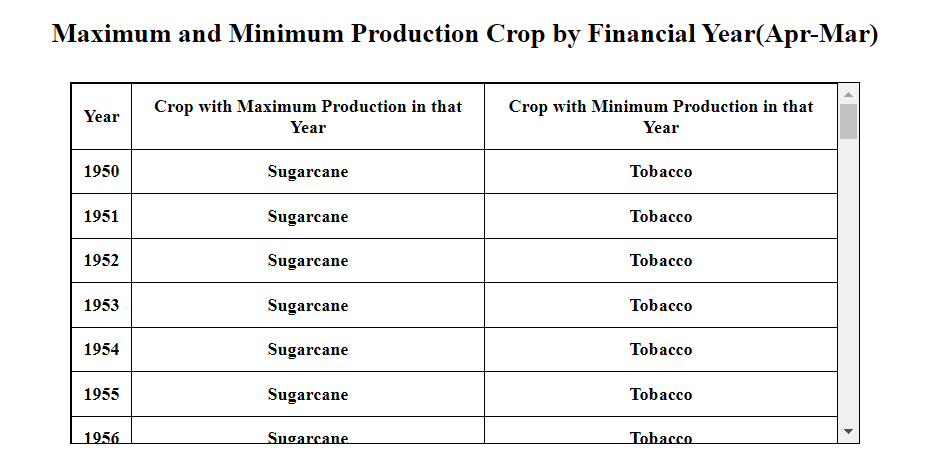
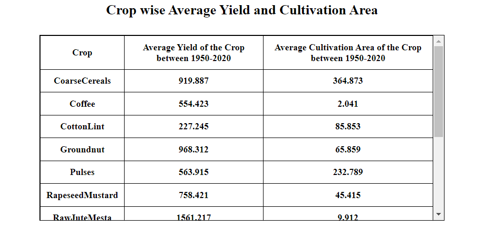
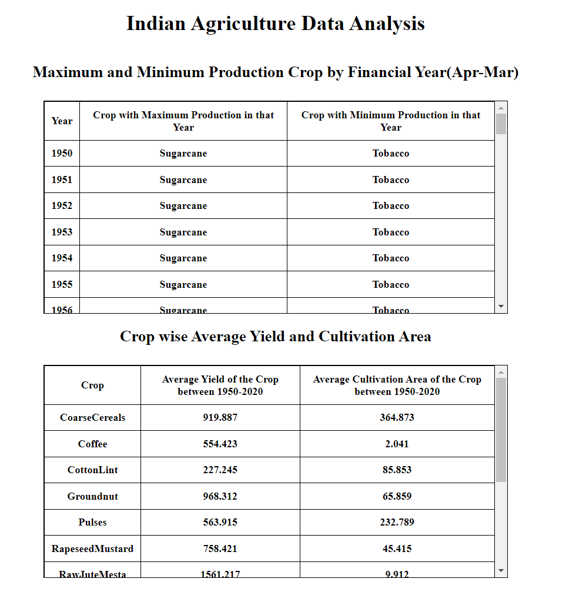

# Indian Agriculture Data Analysis

This project performs data analysis on the Indian Agriculture dataset provided by the National Data and Analytics Platform (NITI Aayog) and displays the results in tables using React and Mantine.

## Prerequisites

Make sure you have the following installed on your machine:

- Node.js (v14 or above)
- Yarn

## Getting Started

Follow these steps to get the application up and running:

1. **Clone the Repository:**

   ```bash
   git clone https://github.com/instinxt/agriculture-insights
   cd agriculture-insights
   ```

2. **Install Dependencies:**

   ```bash
   yarn install
   ```

3. **Start the Application:**

   ```bash
   yarn start
   ```

   This will start the development server and automatically open the application in your default web browser. If it doesn't open automatically, you can manually navigate to `http://localhost:5173`.

# Snapshots

## Yearly Report



## Crop Report



## Full Page


